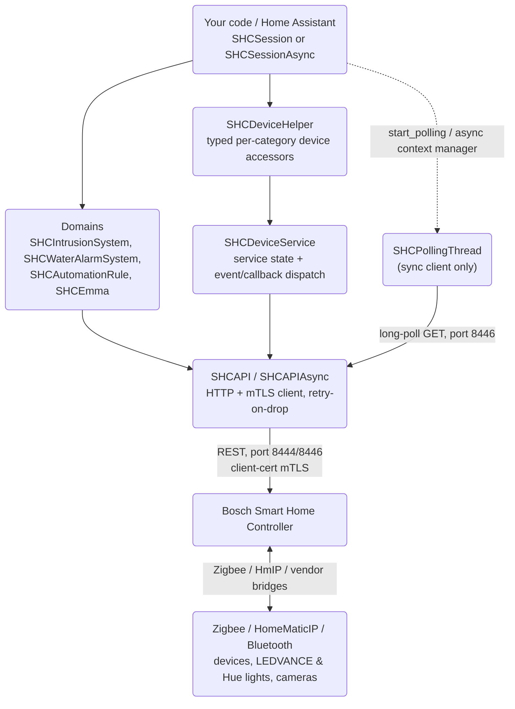
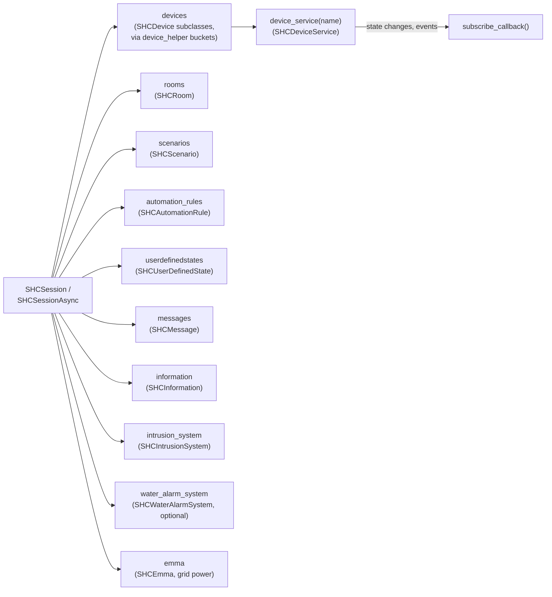

# Bosch Smart Home Controller API Python Library

[](https://pypi.org/project/boschshcpy/)
[](https://github.com/tschamm/boschshcpy/actions/workflows/tests.yml)
[![BuyMeCoffee][buymecoffeebadge-tschamm]][buymecoffee-tschamm]
[![BuyMeCoffee][buymecoffeebadge-mosandlts]][buymecoffee-mosandlts]

Python client library for the Bosch Smart Home Controller (SHC) local REST API.
Communicates directly with the controller over mutual-TLS on the local network — no cloud, no Bosch account required.
The official API documentation is available at [github.com/BoschSmartHome/bosch-shc-api-docs](https://github.com/BoschSmartHome/bosch-shc-api-docs).

Beyond the documented OpenAPI surface, this library also models several endpoints that Bosch's own Android
app uses but never published a spec for (firmware updates, the local automation-rule engine, hydraulic
balancing, ...) — these were traced by decompiling the official app and/or capturing live traffic against a
real controller. Anything not confirmed against real hardware is called out explicitly below and in the
relevant docstrings.

---

## Contents

- [Quick start](#quick-start)
- [Architecture](#architecture)
- [Install](#install)
- [Supported device services](#supported-device-services)
- [Supported device models](#supported-device-models)
- [Capabilities](#capabilities)
- [Usage](#usage)
- [Rawscans](#rawscans-command-line)
- [Maintainers & support](#maintainers--support)

---

## Quick start

**1 — Install**

```bash
pip install boschshcpy
```

**2 — Register a client certificate**

Press and hold the SHC front button until the LED flashes (registration mode, ~10 s), then:

```bash
boschshc_registerclient -ip 192.168.x.x -pw YOUR_SHC_PASSWORD
```

This writes `cert.pem` and `key.pem` to the working directory.

**3 — Use the session**

```python
import boschshcpy

session = boschshcpy.SHCSession("192.168.x.x", "cert.pem", "key.pem")
session.information.summary()
session.start_polling()          # starts long-poll thread; callbacks fire on state change
# ... your code ...
session.stop_polling()
```

> For asyncio / Home Assistant usage see the [async example](#python-api-async--aiohttp) below.

---

## Architecture



**Sync path** (`SHCSession` + `SHCAPI`): blocking `requests`/`urllib3` calls. A dedicated
`SHCPollingThread` owns the long-poll subscription; state-change callbacks fire from that thread, so any
UI/event-loop consumer must marshal back onto its own thread. Suitable for scripts and simple consumers.

**Async path** (`SHCSessionAsync` + `SHCAPIAsync`): fully `asyncio`-native, built on `aiohttp`. This is
what the [boschshc-hass](https://github.com/tschamm/boschshc-hass) Home Assistant integration uses in
production. Every write method has an `async def async_*` coroutine counterpart; the long-poll loop runs as
a plain asyncio task, no separate thread needed. Both clients retry once on a dropped connection
(`SHCConnectionError`), and both tolerate partial/malformed long-poll messages without stalling the poll
loop.

### Domain model



Every device, room, domain and service tracks its own raw JSON state and refreshes itself either from a
targeted `short_poll()`/`refresh()` call or from the long-poll callback dispatch — nothing here does a
blind full re-enumeration on every update.

## Install

Requires Python ≥ 3.10.

```bash
pip install boschshcpy
```

Current PyPI version: **0.6.1**

## Supported device services

```
TemperatureLevel, HumidityLevel, RoomClimateControl, ShutterContact,
ValveTappet, PowerSwitch, PowerMeter, Routing, PowerSwitchProgram,
PresenceSimulationConfiguration, BinarySwitch, SmokeDetectorCheck, Alarm,
ShutterControl, CameraLight, PrivacyMode, CameraNotification,
IntrusionDetectionControl, Keypad, LatestMotion, AirQualityLevel,
SurveillanceAlarm, BatteryLevel, Thermostat, WaterLeakageSensor,
WaterLeakageSensorTilt, HeatingCircuit, PirSensorConfiguration,
SmartSensitivityControl, DetectionTest, WalkTest, LatestTamper, PollControl,
PetImmunity, OccupancyDetection, MultiLevelSwitch, ChildProtection,
SwitchConfiguration, DimmerConfiguration, Bypass, OutdoorSiren,
CommunicationQuality, BoilerHeating, and more
```

## Supported device models

| Model key | Description |
|---|---|
| `SWD` / `SWD2` / `SWD2_PLUS` / `SWD2_DUAL` | Shutter Contact Gen 1 + Gen 2 (incl. 2 Plus, Dual) |
| `BBL` | Shutter Control |
| `MICROMODULE_SHUTTER` / `MICROMODULE_AWNING` | Micromodule Shutter / Awning |
| `MICROMODULE_BLINDS` | Micromodule Blinds (with tilt) |
| `PSM` | Smart Plug |
| `PLUG_COMPACT` / `PLUG_COMPACT_DUAL` | Smart Plug Compact |
| `BSM` | Light Switch BSM |
| `MICROMODULE_LIGHT_CONTROL` / `MICROMODULE_LIGHT_ATTACHED` | Micromodule Light Control / Attached |
| `MICROMODULE_RELAY` | Micromodule Relay (switch and impulse types) |
| `MICROMODULE_DIMMER` | Micromodule Dimmer |
| `SD` / `SMOKE_DETECTOR2` | Smoke Detector Gen 1 + Gen 2 |
| `SMOKE_DETECTION_SYSTEM` | Smoke Detection System |
| `CAMERA_EYES` | Camera Eyes |
| `CAMERA_360` | Camera 360 |
| `CAMERA_OUTDOOR_GEN2` | Camera Outdoor Gen 2 |
| `ROOM_CLIMATE_CONTROL` | Room Climate Control (thermostat group) |
| `HEATING_CIRCUIT` | Heating Circuit |
| `BOILER` | Multiroom Boiler Control (room-linked heat-demand device — spec-only, **not live-tested**, no owned hardware) |
| `TRV` / `TRV_GEN2` / `TRV_GEN2_DUAL` | Thermostat (Radiator Valve) Gen 1 + Gen 2 |
| `THB` / `BWTH` / `BWTH24` | Wall Thermostat |
| `RTH2_BAT` / `RTH2_230` | Room Thermostat 2 |
| `WRC2` / `SWITCH2` | Universal Switch |
| `MD` / `MD2` | Motion Detector Gen 1 + Gen 2 [+M] |
| `PRESENCE_SIMULATION_SERVICE` | Presence Simulation System |
| `TWINGUARD` | Twinguard (smoke + air quality) |
| `WLS` | Water Leakage Sensor |
| `OUTDOOR_SIREN` | Outdoor Siren (test-alarm trigger, power-supply diagnostics) |
| `LEDVANCE_LIGHT` / `HUE_LIGHT` | LEDVANCE / Hue lights (via SHC) |

## Capabilities

Beyond straightforward device-service read/write, the library covers a number of controller-wide and
cross-device features. Everything here is additive on top of the per-device services above.

### Firmware updates

Two independent, device-agnostic surfaces (APK-traced, not in the official OpenAPI spec):

- **Controller firmware**: `SHCInformation.start_software_update()` /
  `async_start_software_update()` triggers the SHC's own firmware install (`POST
  rootdevices/startSoftwareUpdate`). Controller-wide update status is available via `SHCInformation`
  fields such as `available_version`, `last_update_result`, `update_activation_timeout`, `api_versions`,
  and `shc_generation`.
- **Per-device firmware**: `SHCDevice.firmware_update_state()` / `async_firmware_update_state()` probes
  a device's own firmware lifecycle (`GET devicemanagement/firmware/{deviceId}`) independent of which
  services that device advertises — returns one of `Fetching`, `UpToDate`, `UpdateRunning`,
  `TransferringUpdate`, `AwaitingUserInteraction`, `AwaitingActivation`, `AwaitingActivationTimeout`,
  `UpdatePending`, `UpdateAvailable`, `UpToDateAwaitingUserInteraction`, `Failed`, `Unknown`, or `None` if
  the device has no firmware capability at all (e.g. virtual devices, the controller's own root device).
  `SHCDevice.activate_firmware_update()` / `async_activate_firmware_update()` (`PUT
  devicemanagement/firmware/{deviceId}/activate`) then triggers the actual install.

Both the state probe and the install action have been confirmed end-to-end against real hardware: a
TRV_GEN2 radiator thermostat correctly reported `AwaitingActivation`, matching the Bosch app at the same
moment, and triggering the install walked the real device through
`AwaitingActivation → UpdatePending → Unknown → UpToDateAwaitingUserInteraction` over roughly 90 seconds,
staying fully functional throughout.

### Local automation-rule engine

`SHCAutomationRule` models the native "if this then that" rules the Bosch app's own automation editor
manages (arm/disarm state, keypad presses, astro time, shutter contacts, user-defined states, ... driving
plug/light/climate/camera/notification actions) — an entirely separate system from Home Assistant's own
automations, undocumented in the official spec, APK-traced and confirmed live against a real SHC with 23
real user-configured rules.

```python
for rule in session.automation_rules:
    rule.summary()               # id, name, enabled, trigger/condition/action counts

rule = session.automation_rule("some-rule-id")
rule.set_enabled(False)          # or await rule.async_set_enabled(False)
rule.trigger()                   # or await rule.async_trigger() — fire it manually, right now
rule.refresh()                   # re-fetch just this rule
```

Deleting a rule is available at the API layer (`session.api.delete_automation_rule(rule_id)`); it isn't
(yet) wrapped as an `SHCAutomationRule` instance method.

### Whole-home water-leak alarm system

`session.water_alarm_system` (an `SHCWaterAlarmSystem`, documented in the official
`WaterDetectionSystem` OpenAPI spec) mirrors the whole-installation alarm state the Bosch app shows,
**separate from** the individual per-device `WaterLeakageSensor`/`WaterLeakageSensorTilt` services exposed
on each `SHCWaterLeakageSensor` (`session.device_helper.water_leakage_detectors`) — the domain aggregates
across all water sensors in the installation, while each device still reports its own local leak/tilt
state independently.

```python
if session.water_alarm_system is not None:      # None on installs with no water sensors at all
    wa = session.water_alarm_system
    print(wa.available, wa.alarm_state)          # AlarmState.ALARM_OFF / WATER_ALARM / ALARM_MUTED
    print(wa.first_incident_device_id, wa.first_incident_room_name, wa.first_incident_timestamp)
    wa.mute()                                    # or await wa.async_mute()
```

The domain degrades gracefully (simply absent, `session.water_alarm_system is None`) on installations
without any water-leak sensors.

### Intrusion detection (arm/disarm + read-only discovery)

`session.intrusion_system` (`SHCIntrusionSystem`) covers the interactive controls:

```python
session.intrusion_system.arm()                       # default profile
session.intrusion_system.arm_full_protection()        # profile 0
session.intrusion_system.arm_partial_protection()     # profile 1
session.intrusion_system.arm_individual_protection()  # profile 2 (custom)
session.intrusion_system.disarm()
session.intrusion_system.mute()                       # silence an active alarm
print(session.intrusion_system.arming_state, session.intrusion_system.alarm_state)
print(session.intrusion_system.active_configuration_profile)   # Profile.UNKNOWN if unrecognized
print(session.intrusion_system.security_gaps)
```

On top of that, the API layer exposes read-only discovery endpoints for the intrusion system's own
configuration surface — profiles, per-profile states, and endpoint actuator/trigger listings — laying the
groundwork for exposing intrusion-system *configuration* (not just arm/disarm) to consumers in future:

```python
session.api.get_intrusion_profiles()
session.api.get_intrusion_profile(profile_id)
session.api.get_intrusion_profile_states()
session.api.get_intrusion_endpoint_alarm_actuators()
session.api.get_intrusion_endpoint_alarm_triggers()
session.api.get_intrusion_endpoint_reminder_actuators()
```

### Thermostat regulation, per-room temperature drop, and related climate surfaces

- **Regulation algorithm** (per thermostat device): `SHCDevice.thermostat_regulation_algorithm()` /
  `async_thermostat_regulation_algorithm()` to read, `set_thermostat_regulation_algorithm()` /
  `async_set_thermostat_regulation_algorithm()` to write — returns `None` (rather than raising) on devices
  without this capability. Confirmed live.
- **Per-room temperature drop** (`SHCRoom`, the anti-frost/window-open compensation setting from the
  app's room-detail screen): `room.temperature_drop_service` / `async_temperature_drop_service`,
  `set_temperature_drop_enabled()` / `async_set_temperature_drop_enabled()`,
  `set_temperature_drop_value()` / `async_set_temperature_drop_value()`. Confirmed live across 12 real
  rooms.
- **Hydraulic balancing configuration** — `SHCAPI`/`SHCAPIAsync`
  `get_hydraulic_balancing_configurations()` / `get_hydraulic_balancing_configuration(config_id)` /
  `put_hydraulic_balancing_configuration(config_id, config)`. **Not in the official OpenAPI spec, APK
  ground-truth, and NOT live-confirmed** — no hydraulic-balancing-capable device is available to test
  against; treat as provisional.
- **Comfort-zone templates** — `SHCAPI`/`SHCAPIAsync` `get_comfort_zone_templates(sensor_id)` /
  `put_comfort_zone_template(sensor_id, comfort_zone)`. Same caveat as hydraulic balancing: APK-derived,
  **not live-confirmed**.
- **Multiroom Boiler Control** (`SHCBoiler` device, `BoilerHeatingService`) — a device family plus a
  room-linking API: `SHCAPI`/`SHCAPIAsync` `get_boiler_capable_rooms()`, `get_boiler_linked_rooms(boiler_id)`
  / `put_boiler_linked_rooms(boiler_id, room_ids)`, `put_boiler_add_room(boiler_id, room_id)`. Fully
  documented in the official spec but was never implemented until 0.6.0. **Not live-tested** — no owned
  Boiler hardware; implemented carefully and directly from the spec, flagged as such in every relevant
  docstring. `SHCBoiler` devices show up through normal enumeration (`session.devices`,
  `session.device(device_id)`) like any other device.

### Whole-home open-doors/open-windows summary

`SHCAPI.get_open_windows()` / `SHCAPIAsync.get_open_windows()` — a single controller-wide summary of which
doors/windows are currently open, live-confirmed against a real installation. The real response is a
strict superset of the documented `Windows` schema — it also includes `bypassedDoors`, `bypassedWindows`,
`openOthers`, `bypassedOthers`, and `unknownOthers` beyond what the official spec documents (reported
upstream).

### Zigbee routing diagnostics

`SHCAPI`/`SHCAPIAsync`/`SHCSession`/`SHCSessionAsync` `get_zigbee_routing_info(device_id)` — an
APK-discovered endpoint (`GET /smarthome/zigbee/routinginfo/{deviceId}`, not in the official docs),
confirmed working against real hardware. Returns an `SHCZigbeeRoutingInfo` (`device_id`,
`aggregated_quality`, and an ordered `route` of `ZigbeeRoutingHop(device_id, quality)` entries) describing
the mesh path back to the controller — useful for diagnosing a flaky Zigbee end device.

### EMMA grid power

`session.emma` (`SHCEmma`) exposes the EMMA energy-management/grid-power domain, when present on the
installation.

## Usage

### Register a new client

Press and hold the button on the SHC controller until the LED starts flashing (registration mode).
Then run:

```bash
boschshc_registerclient -ip YOUR_SHC_IP -pw YOUR_SHC_PASSWORD
```

This writes a certificate/key pair (`cert.pem` / `key.pem`) to the working directory. The CLI prompts for
the SHC password via a hidden `getpass` prompt if `-pw` is omitted, and writes the private key with `0600`
permissions — neither the password nor the key material is ever printed to stdout or left in shell
history.

More details: [Bosch API docs — register a client](https://github.com/BoschSmartHome/bosch-shc-api-docs/tree/master/postman#register-a-new-client-to-the-bosch-smart-home-controller)

### Python API (sync)

```python
import boschshcpy

# Create session (lazy=False enumerates all devices on connect)
session = boschshcpy.SHCSession(
    controller_ip="192.168.25.51",
    certificate="cert.pem",
    key="key.pem",
)
session.information.summary()

# Access a device and service
device = session.device("roomClimateControl_hz_5")
service = device.device_service("TemperatureLevel")
print(service.temperature)

# Short-poll a single service
service.short_poll()

# Writing to a service — every writable service field has a setter.
# Sync property setter, or an async_set_* coroutine for the event loop:
device.multi_level_switch = 50              # sync write (PUT to the service)
await device.async_set_multi_level_switch(50)

# Motion Detector II examples (services the SHC exposes for the MD2 [+M]):
from boschshcpy.services_impl import DetectionTestService, PollControlService
md2 = session.device_helper.motion_detectors2[0]
md2.set_detection_state_request(                 # start a walk/detection test
    DetectionTestService.DetectionStateRequest.DETECTION_STATE_START)
md2.tamper_protection_enabled = True             # toggle tamper protection
md2.reset_tampered_state()                       # POST resetTamperedState
md2.long_poll_interval = PollControlService.PollControlState.SHORT  # orientation-light response
print(md2.profile, md2.supported_profiles)       # installation profile (read-only unless writable, see below)
md2.set_profile("OUTDOOR")                       # write the installation profile (validated against supported_profiles)

# Start long-poll thread (non-blocking)
session.start_polling()

# ... do work, handle callbacks ...

# Stop polling
session.stop_polling()

# Arm the intrusion detection system
session.intrusion_system.arm()

# Trigger the controller's own firmware update
session.information.start_software_update()

# Fire a local automation rule manually
session.automation_rules[0].trigger()

# Raw API dump
scan_result = session.rawscan(command="devices")
```

### Python API (async / aiohttp)

```python
import asyncio
import boschshcpy

async def main():
    session = boschshcpy.SHCSessionAsync(
        controller_ip="192.168.25.51",
        certificate="cert.pem",
        key="key.pem",
    )
    async with session:
        for device in session.device_helper.smart_plugs:
            await device.async_set_state(True)  # turn on

        if session.water_alarm_system is not None:
            print(session.water_alarm_system.alarm_state)

asyncio.run(main())
```

### Device helper accessors (`SHCSession.device_helper`)

`SHCDeviceHelper` exposes typed properties for each device category:

```
shutter_contacts, shutter_contacts2, shutter_controls,
micromodule_shutter_controls, micromodule_blinds, micromodule_relays,
micromodule_impulse_relays, micromodule_light_controls,
micromodule_light_attached, micromodule_dimmers, light_switches_bsm,
smart_plugs, smart_plugs_compact, smoke_detectors, smoke_detection_system,
climate_controls, heating_circuits, thermostats, wallthermostats,
roomthermostats, motion_detectors, motion_detectors2, twinguards,
universal_switches, camera_eyes, camera_360, camera_outdoor_gen2,
ledvance_lights, hue_lights, water_leakage_detectors,
presence_simulation_system, outdoor_sirens
```

`SHCBoiler` devices aren't (yet) exposed via a dedicated `device_helper` bucket — access them through
normal device enumeration (`session.devices`, `session.device(device_id)`).

Other session attributes: `session.scenarios`, `session.rooms`, `session.automation_rules`,
`session.userdefinedstates`, `session.messages`, `session.intrusion_system`,
`session.water_alarm_system` (`None` if the installation has no water sensors), `session.emma` (EMMA grid
power), `session.information` (`SHCInformation` — firmware/version/network details).

## Rawscans (command-line)

### Public information
```bash
boschshc_rawscan -ip YOUR_SHC_IP -cert cert.pem -key key.pem public_information
```

### All devices
```bash
boschshc_rawscan -ip YOUR_SHC_IP -cert cert.pem -key key.pem devices
```

### Single device
```bash
boschshc_rawscan -ip YOUR_SHC_IP -cert cert.pem -key key.pem device YOUR_DEVICE_ID
```

### Services of a device
```bash
boschshc_rawscan -ip YOUR_SHC_IP -cert cert.pem -key key.pem device_services YOUR_DEVICE_ID
```

### Single service of a device
```bash
boschshc_rawscan -ip YOUR_SHC_IP -cert cert.pem -key key.pem device_service YOUR_DEVICE_ID YOUR_SERVICE_ID
```

### All scenarios
```bash
boschshc_rawscan -ip YOUR_SHC_IP -cert cert.pem -key key.pem scenarios
```

### All rooms
```bash
boschshc_rawscan -ip YOUR_SHC_IP -cert cert.pem -key key.pem rooms
```

Example device output:
```json
{
    "@type": "device",
    "rootDeviceId": "xx-xx-xx-xx-xx-xx",
    "id": "hdm:HomeMaticIP:30xxx",
    "deviceServiceIds": [
        "Thermostat", "BatteryLevel", "ValveTappet",
        "SilentMode", "TemperatureLevel", "Linking", "TemperatureOffset"
    ],
    "manufacturer": "BOSCH",
    "roomId": "hz_8",
    "deviceModel": "TRV",
    "serial": "30xxx",
    "name": "Test Thermostat",
    "status": "AVAILABLE"
}
```

## Maintainers / support

| Role | |
|---|---|
| Original authors | Clemens-Alexander Brust ([@cabrust](https://github.com/cabrust)), Thomas Schamm ([@tschamm](https://github.com/tschamm)) |
| Co-maintainer | Thomas Mosandl ([@mosandlt](https://github.com/mosandlt)) |

[![Buy tschamm a coffee][buymecoffeebadge-tschamm]][buymecoffee-tschamm]
[![Buy mosandlts a coffee][buymecoffeebadge-mosandlts]][buymecoffee-mosandlts]

Bug reports and feature requests: [github.com/tschamm/boschshcpy/issues](https://github.com/tschamm/boschshcpy/issues)

[buymecoffee-tschamm]: https://www.buymeacoffee.com/tschamm
[buymecoffeebadge-tschamm]: https://img.shields.io/badge/buy%20tschamm%20a%20double%20espresso-donate-yellow.svg
[buymecoffee-mosandlts]: https://buymeacoffee.com/mosandlts
[buymecoffeebadge-mosandlts]: https://img.shields.io/badge/buy%20mosandlts%20a%20coffee-donate-yellow.svg
